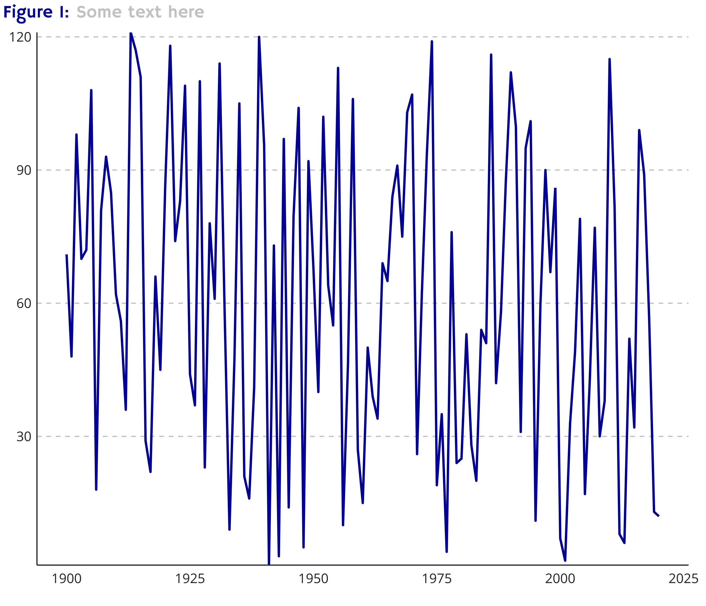
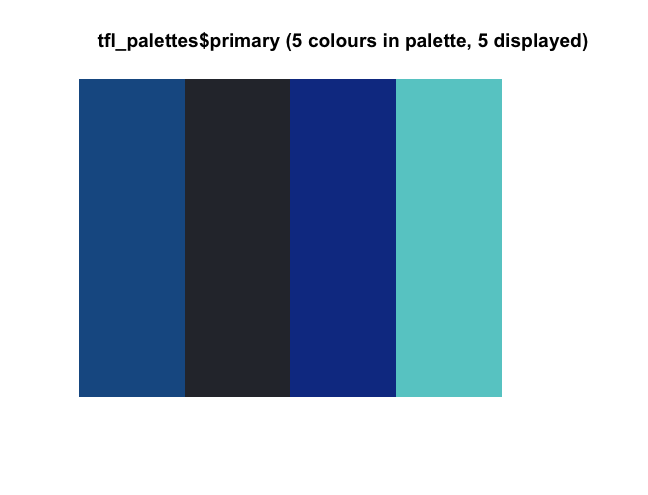

## tflplot

This repo is inspired by the excellent [BBC bbplot](https://github.com/bbc/bbplot/) package, and aims to provide helpful functions to produce graphics made using `ggplot2` with colours used by Transport for London (TfL). These colours used in this package can be found in the [TfL Digital Design Guide](http://content.tfl.gov.uk/design-style-guide.pdf). **Please note that this is not endorsed by Transport for London and is a personal project to learn how to create packages in R.**

## Installation

This package is not available on CRAN and as such must be installed using the `devtools` package.


```
devtools::install_github('alex-drake/tflplot')
```

## Using the functions

`tfl_style()` has no arguements. Add it to the `ggplot` chain after you have created a plot. It adds a theme similar to that seen on charts published on the TfL website. You would use it in your workflow like so:

```
p <- ggplot(data=df, aes(x=year, y=vals)) +
  geom_path(size=1, color = tfl_cols("lu blue")) +
  tfl_style()
```

`tfl_cols()` is a list of named colours as defined in the TfL Digital Design Style Guide. It can be called to get the HEX code for a particular mode, or can be called without arguements to see all availabe colours. For example, you could request the HEX code for London Buses by using `tfl_cols("buses")` or the London Underground line "Bakerloo" by calling `tfl_cols("bakerloo")`.

`tfl_pal()` can be used to extract n colours from a named palette (eg "underground") if discrete colours are required. It can also be used to interpolate colours if you are displaying continous data.

`view_palette()` is a utility function that allows you to view the colours in your requested palette eg `view_palette(tfl_pal(palette="underground", n=8, type="discrete"))`




`finalise_plot()` will save your plot, ready for publication (or whatever you want to do with it). It will add a caption to the top left of the chart, along with figure number/reference. It will then be saved using the specified filepath.

```
finalise_plot(plot_name = p,
              caption = "Smart Caption",
              figure_number = 14,
              save_filepath = "filename.png",
              width_pixels = 640,
              height_pixels = 550)
```

## To Do

* Option to merge palettes (modes and underground?) to use unique colours in discrete scales where originally requested palette doesn't have enough colours


## Notes

* Using GoogleFonts (Hammersmith One + Open Sans?) as an alternative but can't render them in RStudio atm - must view outputs post-export. Would like to use Johnston100 for official font but requires appropriate license to use
